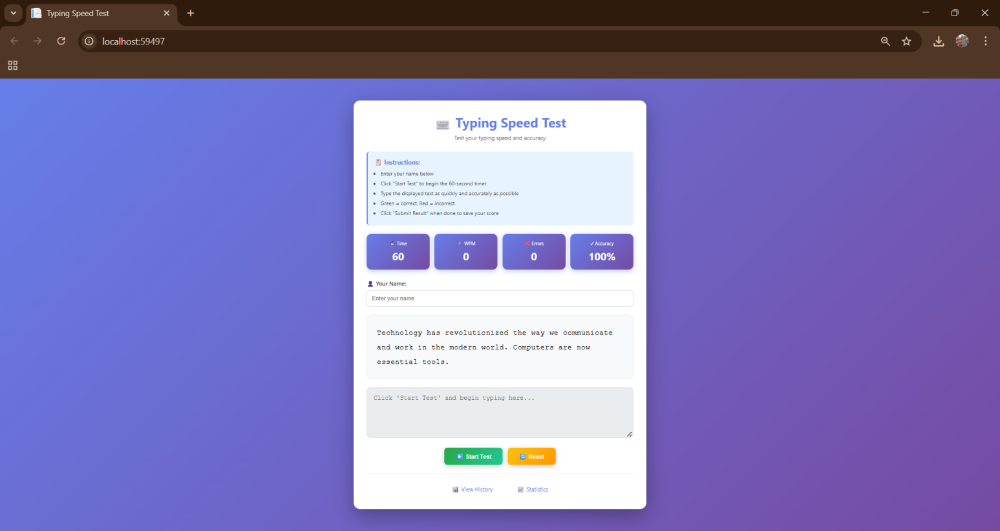
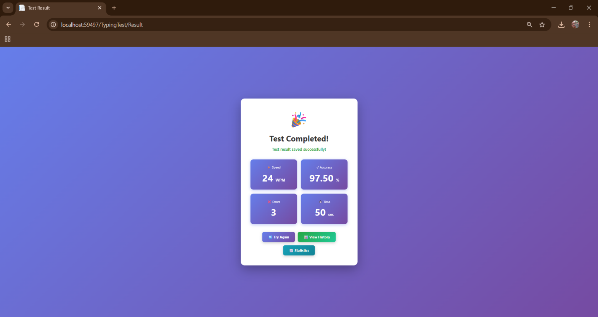
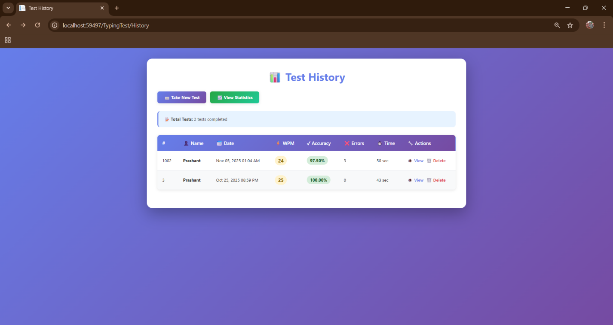
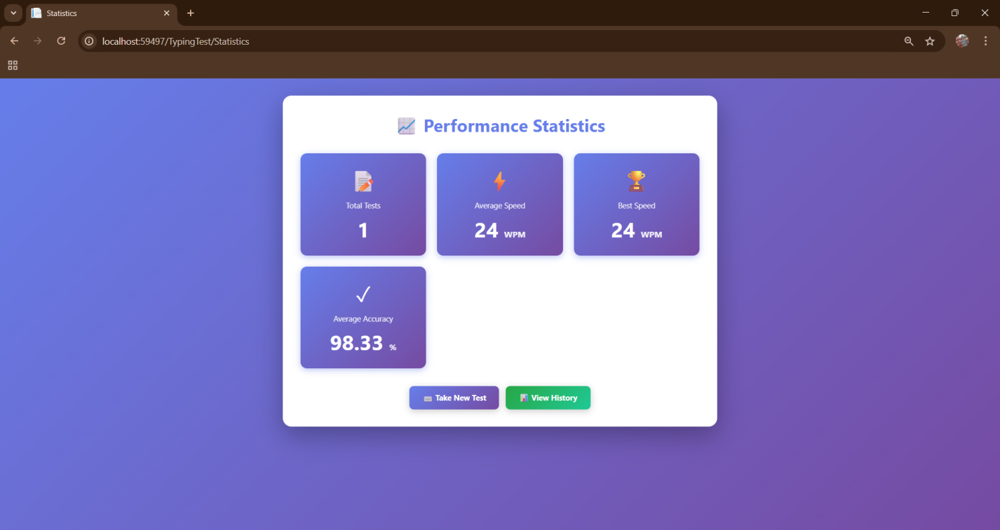

# Typing Speed Tester

A web-based typing speed test application built with ASP.NET MVC and ADO.NET.

## 📋 Description

The Typing Speed Tester is an interactive web application that enables users to test, analyze, and track their typing speed and accuracy in real-time. The system displays random text passages, measures performance metrics (WPM, accuracy, errors), and stores results in SQL Server database.

## ✨ Features

- ⌨️ Interactive 60-second typing test
- 📊 Real-time performance tracking (WPM, accuracy, errors)
- 💾 Persistent data storage using SQL Server
- 📈 Complete typing history with statistics
- 🎨 Clean and responsive user interface
- 🔒 Secure database operations with parameterized queries

## 🛠️ Technologies Used

- **Backend**: C#, ASP.NET MVC 5, ADO.NET
- **Frontend**: HTML5, CSS3, JavaScript, Razor
- **Database**: SQL Server (LocalDB)
- **IDE**: Visual Studio 2022
- **Framework**: .NET Framework 4.7.2

## 📸 Screenshots

### 1. Main Typing Test Interface

*Interactive typing test page with real-time statistics and countdown timer*

### 2. Test Result Page

*Final performance metrics displayed after completing the test*

### 3. Test History

*Complete list of all past typing tests with performance indicators*

### 4. Performance Statistics

*Overall performance summary showing total tests, average speed, and best score*

## 🚀 Getting Started

### Prerequisites

- Visual Studio 2022
- SQL Server LocalDB
- .NET Framework 4.7.2 or higher

### Installation

1. Clone the repository:
```bash
git clone https://github.com/YourUsername/typing-speed-tester.git
```

2. Open the solution in Visual Studio:
```
TypingSpeedTester.sln
```

3. Update the connection string in `Web.config`:
```xml
<connectionStrings>
  <add name="TypingTestDB" 
       connectionString="Data Source=(localdb)\MSSQLLocalDB;Initial Catalog=TypingTestDB;Integrated Security=True" 
       providerName="System.Data.SqlClient" />
</connectionStrings>
```

4. Create the database:
- Open SQL Server Object Explorer
- Create database: `TypingTestDB`
- Run the SQL script from `Database/CreateTable.sql`

5. Build and run the project (F5)

## 📁 Project Structure
```
TypingSpeedTester/
├── Controllers/        # MVC Controllers
├── Models/            # Data models
├── DAL/               # Data Access Layer (ADO.NET)
├── Views/             # Razor views
│   └── TypingTest/
├── App_Start/         # Configuration files
├── Content/           # CSS files
├── Scripts/           # JavaScript files
└── Web.config         # Application configuration
```

## 🗄️ Database Schema

**Table: TypingTests**
- TestId (INT, PK, IDENTITY)
- UserName (NVARCHAR(100))
- TestDate (DATETIME)
- WPM (INT)
- Accuracy (DECIMAL(5,2))
- ErrorCount (INT)
- TimeDuration (INT)
- TestText (NVARCHAR(MAX))
- TypedText (NVARCHAR(MAX))

## 🎯 Features Breakdown

### 1. Typing Test
- Random text selection
- 60-second timer
- Real-time character comparison
- Color-coded feedback (green/red)

### 2. Performance Metrics
- Words Per Minute (WPM) calculation
- Accuracy percentage
- Error counting
- Time tracking

### 3. Data Management
- Save test results to database
- View complete test history
- Delete old records
- Performance statistics

## 🔐 Security Features

- Parameterized SQL queries (SQL injection prevention)
- Input validation
- Error handling with try-catch blocks

## 📊 MVC Architecture

- **Model**: TypingTest.cs - Data structure
- **View**: Razor views for UI
- **Controller**: TypingTestController - Business logic
- **DAL**: TypingTestDAL - Database operations using ADO.NET

## 👨‍💻 Author

**Prashant Vala**
- GitHub: [@prashantvala27](https://github.com/prashantvala27)
- Email: prashantvala2702@gmail.com

## 📝 License

This project is licensed under the MIT License - see the LICENSE file for details.

## 📞 Contact

For any queries, please reach out via GitHub issues or email.

---

Made with ❤️ for .NET Technologies Mini Project
